# Projet de Geometry Modelling 3D

Ce dépôt contient l'ensemble des travaux pratiques et des fonctionnalités obligatoires demandées dans le cadre du cours.

---

## Checklist des Fonctionnalités Implémentées

### 1. Lecture de Fichier (`readFile`)
- **Description** : Module d'importation de fichiers de maillage 3D (formats `.obj`).
- **Statut** : 🟩 Terminé
- **Détails** : Récupère les lignes de sommets (v) et de faces (f) pour construire notre structure de demi-arêtes.
- **Captures** : 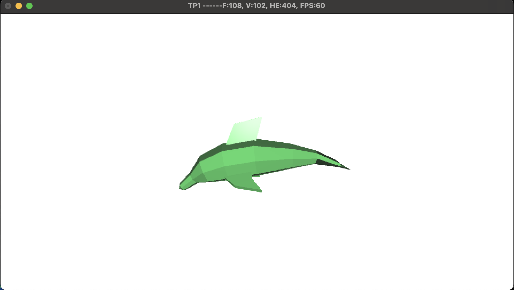

### 2. Calcul des Normales (`compute normals`)
- **Description** : Calcul des normales des faces et des sommets.
- **Statut** : 🟩 Terminé
- **Détails** : Permet au visualisateur d'afficher correctement les ombres et les reflets de lumière sur l'objet.
- **Captures** : 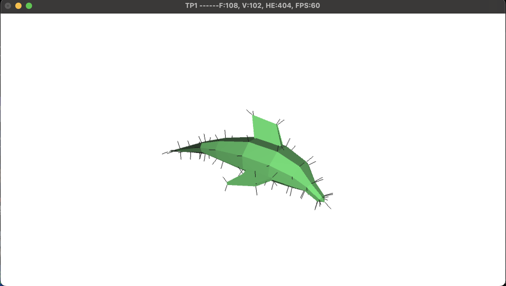
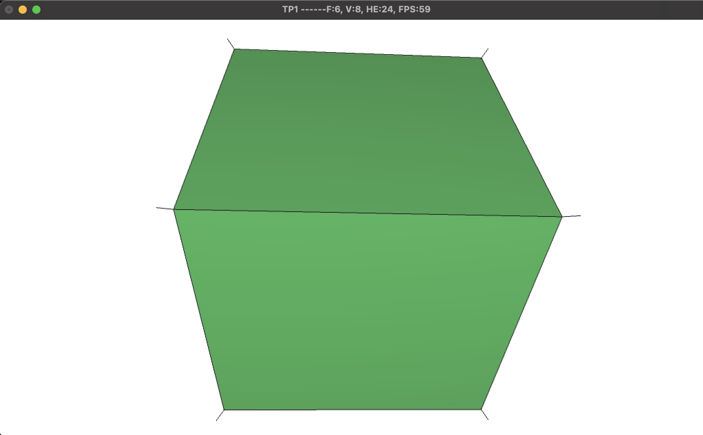

### 3. Détection de Silhouette (`Silhouette`)
- **Description** : Dessin des contours extérieurs du modèle selon l'angle de la caméra.
- **Statut** : 🟩 Terminé
- **Détails** : Repose sur le test du produit scalaire entre le vecteur de vue et la normale des faces adjacentes à une arête ($\vec{n}_1 \cdot \vec{v} \times \vec{n}_2 \cdot \vec{v} < 0$).
- **Captures** : 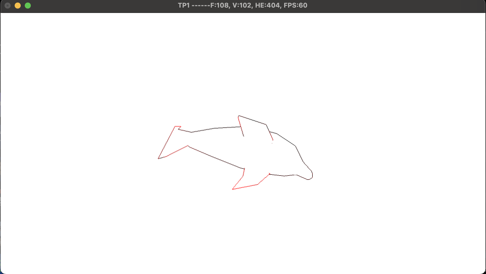

### 4. Triangulation de Polygones (`triangulation`)
- **Description** : Algorithme de découpage des faces polygonales complexes en triangles simples.
- **Statut** : 🟩 Terminé (2 Niveaux)
- **Détails** : 
  - *Basique* : Gestion des faces convexes par fan-triangulation. (Ne marche pas avec les surfaces concaves en testant avec `gear.obj`)
  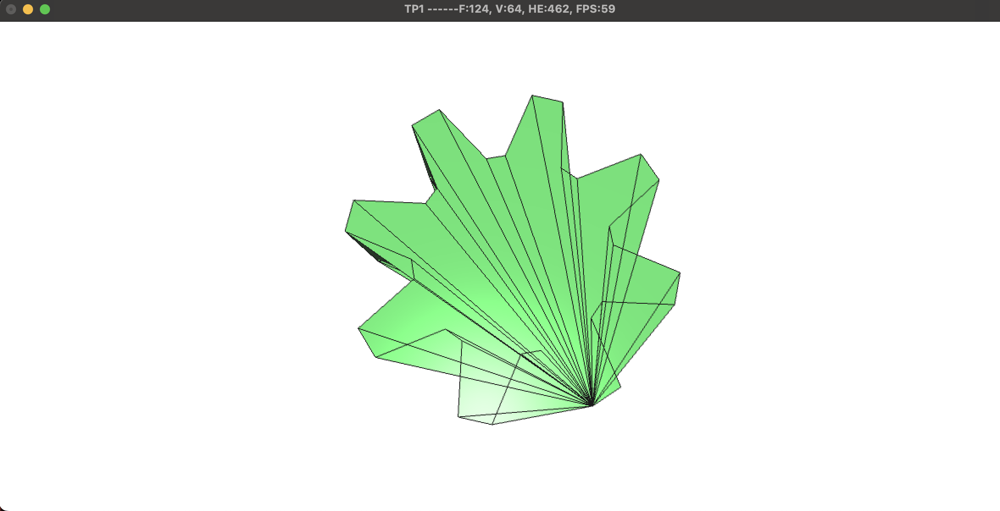
  - *Avancé* : Gestion des faces concaves (via l'algorithme des oreilles / *Ear Clipping*).
- **Captures** :  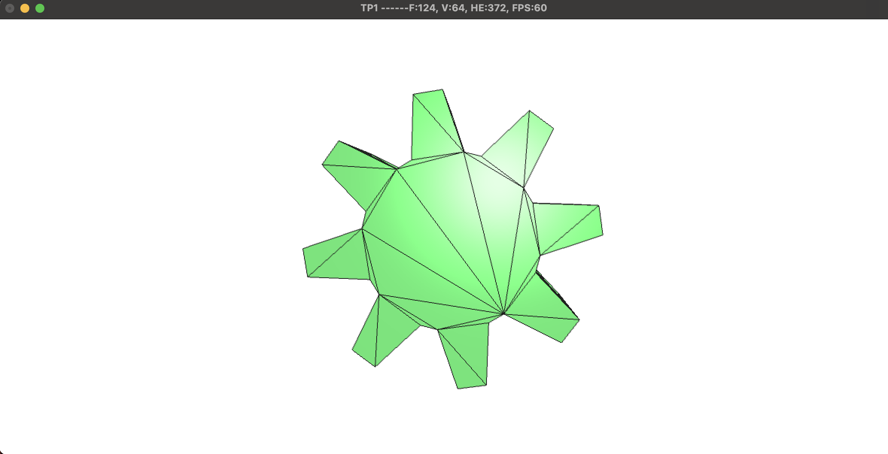
 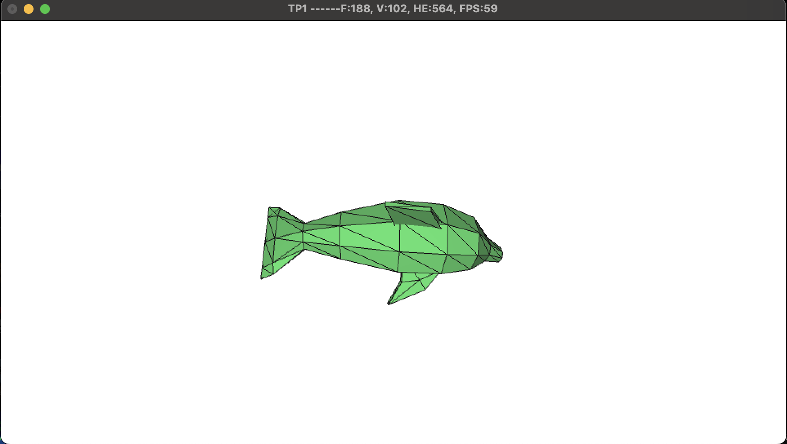

### 5. Tests de Structure Half-Edge (`half-edge data structure tests`)
- **Description** : Suite de tests unitaires et de cohérence topologique intégrée via la fonction `checkMesh()`.
- **Statut** : 🟩 Terminé
- **Détails** : Des boucles testent si tous les `twin` se répondent bien, si les cycles `next/prev` tournent rond, et si la formule d'`Euler` est respectée pour être sûr qu'il n'y a pas de bug topologique.
- **Captures** : 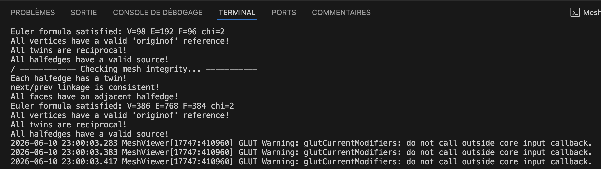

### 6. Surface de Révolution (`surface of revolution`)
- **Description** : Génération d'un maillage 3D complet (Quads) à partir d'un profil de points 2D pivotant autour de l'axe vertical.
- **Statut** : 🟩 Terminé
- **Détails** : Génère un pion d'échecs en faisant tourner une suite de points autour de l'axe vertical, en reliant bien les arêtes jumeaux (twin) pour fermer la forme. (profile généré par Gemini).
- **Captures** : 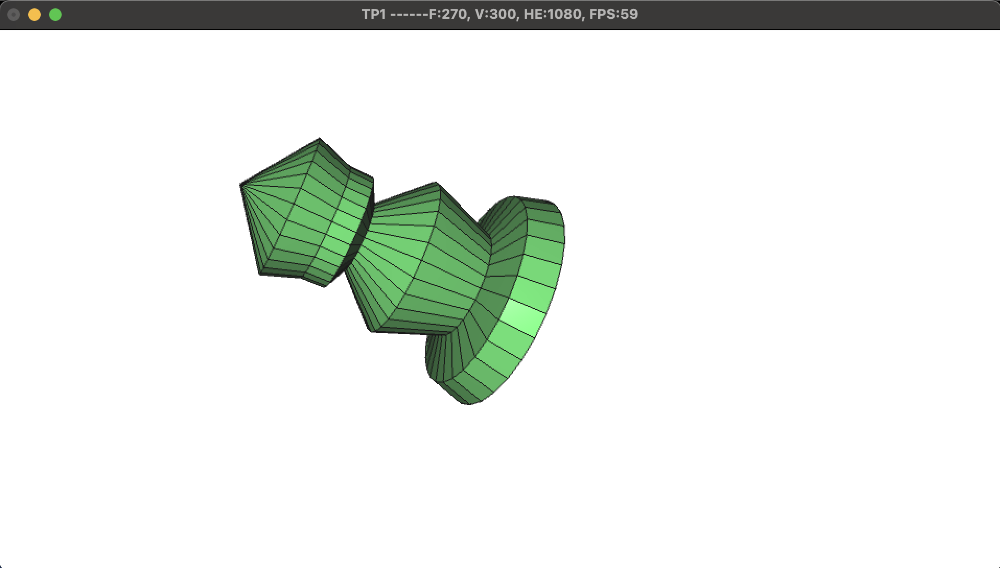

### 7. Simplification de Maillage (`mesh simplification via shortest edge collapse`)
- **Description** : Allégement du modèle en supprimant des arêtes.
- **Statut** : 🟩 Terminé
- **Détails** : L'algorithme cherche l'arête la plus courte du maillage entier et la fusionne en un seul sommet, puis nettoie les faces écrasées et reconnecte proprement les voisins.
- **Captures** : 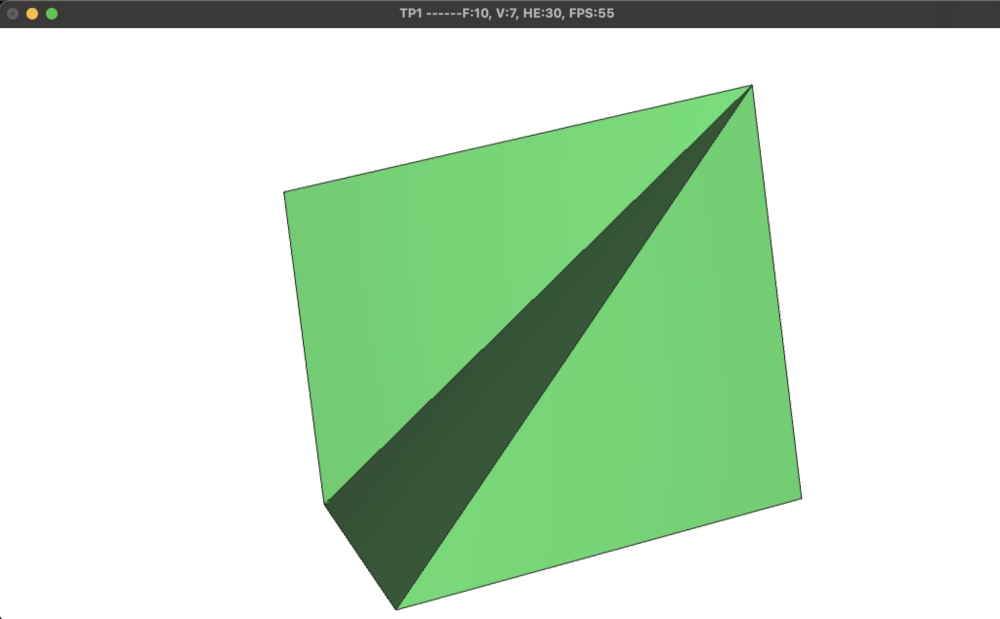

### 8. Subdivision de Catmull-Clark (`Catmull-Clark mesh subdivision`)
- **Description** : Algorithme de subdivision de surface pour lisser et arrondir les maillages de manière itérative.
- **Statut** : 🟩 Terminé
- **Détails** : Divise chaque face en quadrilatères et recalcule la position de tous les points (formules de Catmull-Clark).
- **Captures** : 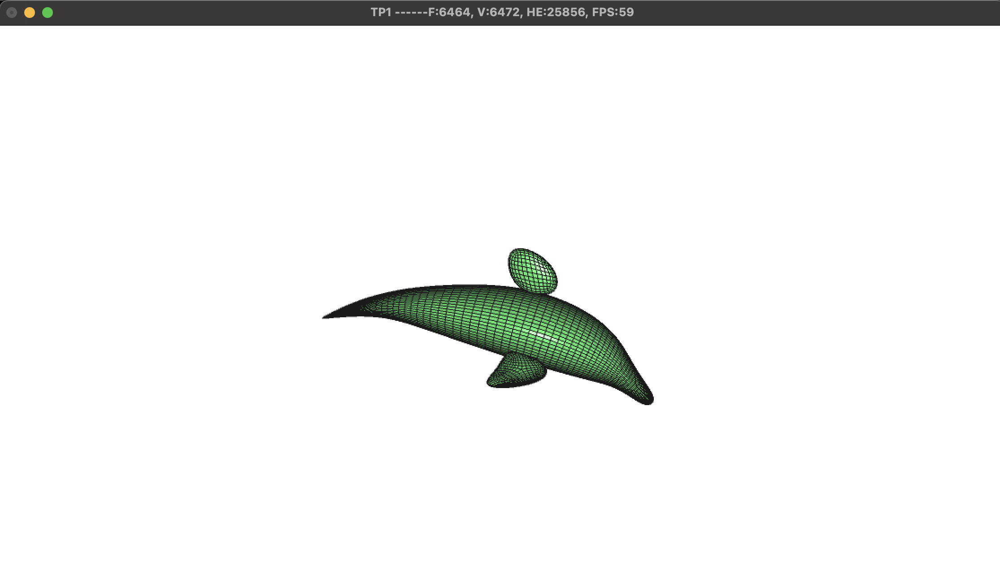
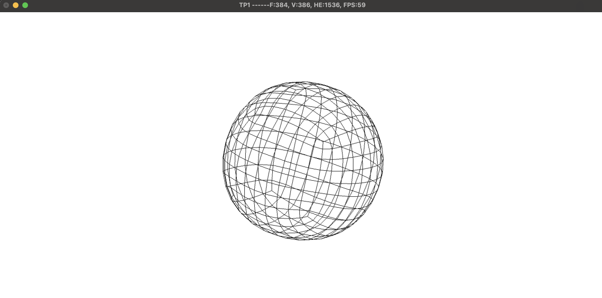
---

## Déclaration et Justification de l'Utilisation de l'IA (Gemini)

Le LLM **Gemini** a été utilisé comme **assistant de programmation et collaborateur technique** tout au long du développement de ce projet.

L'usage de l'intelligence artificielle a été ciblé sur des aspects précis :

> **Note d'intégrité académique** : L'IA n'a jamais été utilisée pour concevoir passivement le projet à ma place. Chaque fonction générée ou optimisée a fait l'objet d'une analyse critique, d'une phase de tests rigoureuse (notamment via notre protocole `checkMesh()`) et d'une réadaptation logique pour correspondre parfaitement aux structures de données imposées par l'équipe enseignante. L'étudiant reste le concepteur, le pilote et le garant de la validité du code final.